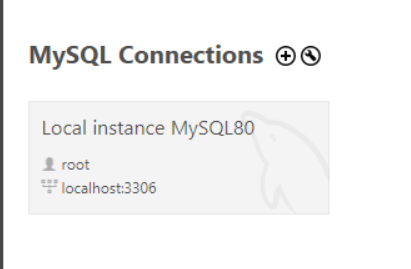
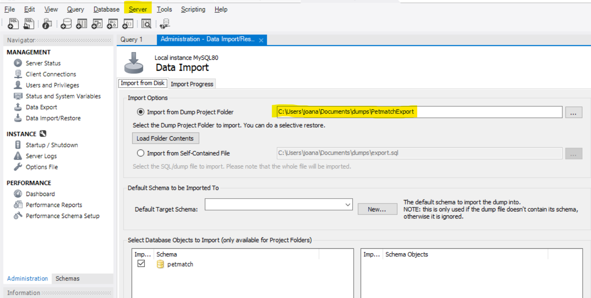
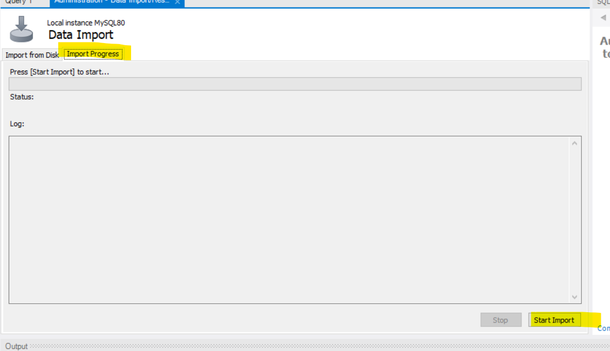

# Sistema de adoção de pets - PETMATCH (ver. 2)
Esse projeto é uma remodelação do projeto PetMatch (sistema desenvolvido para a disciplina de Gerẽncia de Projetos) e será adaptado para utilizar o bootstrap

## Ferramentas utilizadas no projeto
- MySql 8.x.x ou superior.
- Python 3.11 ou superior.
- BootStrap 5.1.3

## Passo a passo para execução
### Instalando pacotes necessários
- Execute no terminal o comando `pip install -r requirements.txt`

### Configurando o banco de dados pré-existente
- O projeto, por padrão, já possui um banco de dados alimentado com pets de exemplo. Para utilizá-lo, siga os passos abaixo:
1. No MySQL Workbench, selecionar uma conexão.

2. Vá em *Server* -> *Data Import* -> navegue até a pasta *PetmatchExport* -> *Import Progress* -> *Start Import*
 
3. Agora com o banco de dados importado, é necessário configurar as credenciais de acesso ao banco de dados no arquivo `app.py` na linha 22. Siga o padrão: `app.config['SQLALCHEMY_DATABASE_URI'] = 'mysql+pymysql://<nome_do_user_mysql>:<senha_do_user>@localhost/PetMatch'`
4. Execute o arquivo PetMatch.py, no terminal irá aparecer a url do servidor local para acessar o sistema.

## Credenciais
Caso vocẽ use o banco de dados já alimentado, já existem credenciais de acesso para os usuários, ongs e administradores.
| Tipo de usuário| Email                  | Senha|
|----------------|------------------------|------|
|Admin           |admin1@gmail.com        | 77   |
|Admin           |admin2@gmail.com        | 88   |
|Admin           |admin3@gmail.com        | 77   |
|Admin           |admin4@gmail.com        | 88   |
|Ong             |a4ong@gmail.com         | 11   |
|Ong             |animalderuacg@gmail.com | 11   |
|Usuário normal  |doxino2895@aqqor.com    | 00   |
|Usuário normal  |melobos118@chainds.com  | 11   |
|Usuário normal  |sohew17721@confmin.com  | 22   |

## Rotas
### Do Admin
- O admin possui a visão de todos os animais, usuários e ongs cadastradas no dashboard dele, logo após logar
- Ele pode cadastrar Ongs

### Do Usuário
- Cadastro na barra de navegação da home
- Login na barra de navegação da home
- Lista de pets na barra de navegação da home
- Lista de Ongs na barra de navegação da home
- Edição de perfil na página principal
- A visão do histórico de adoção na página principal
- Lista de chats iniciados na barra de navegação
- Ao clicar em redefinir senha na página de login um email com um link para o recuperação é enviado para o email cadastrado no petmatch, como aqui todas as contas foram criadas usando email temporário pra testar essa funcionalidade tem que ser criada uma nova conta
- Ao clicar em "pets para adoção" na barra de navegação, selecionar um animal e clicar em tenho interesse um chat vai ser iniciado com a ong que cadastrou o animal
- Na aba de /petList tem filtros de exibição de animais

### Do Usuário
- Visão de todos os animais cadastrados após logar com a opção de editar ou excluir o pet
- Na rota de edição ele tem a opção de reservar o animal ou adotar, ao clicar em mudar o status para adotado o campo de adotante vai mostrar uma lista de usuários que clicaram em "Tenho interesse" nesse pet
- O pet que tem o status adotado não aparece mais na lista de pets que os usuários tem acesso, os reservados ainda aparecem
- Opção de cadastro de animais na tela principal
- Lista de chats iniciados na barra de navegação, os chats só são iniciado pelos usuários 

### Chat simultâneo
- Para poder usar o chat como se fosse o user e a ong conversando ao mesmo tempo tem que logar em uma conta usuário em perfil do chrome, e em outro perfil do chrome na conta tipo Ong correspondente no chat
  - Ou só loga como user em um navegador e em outro navegador como a ong correspondente 

